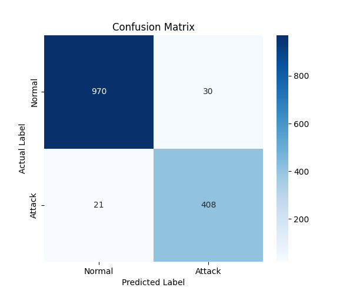

# APEX-IDS2026 Machine Learning Guide

This document outlines the best practices, feature engineering steps, and modeling approaches for training robust Intrusion Detection Systems (IDS) on the APEX-IDS2026 dataset.

## 1. The Dataset Advantage
Unlike legacy datasets (NSL-KDD, CIC-IDS2017), APEX-IDS2026 solves the two biggest problems in IDS research:
1. **Zero False Positives in Tier 1:** Ground truth is established deterministically via physical honeypot correlation, not statistical guessing.
2. **Perfect Class Balance:** With ~1.6M attack flows and ~1.5M normal flows (52% / 48% split), models will not suffer from majority-class bias. You do NOT need SMOTE or undersampling.

## 2. Recommended Features for Training

The dataset provides 33 columns. For standard ML models, we recommend extracting the following structural features:

### Flow Demographics
- `protocol` (Categorical: TCP, UDP, ICMP)
- `flow_duration_class` (Categorical: instant, sub-second, short, medium, long)
- `src_port_category` & `dst_port_category` (Categorical: well-known, registered, dynamic)

### Computed Rate Features
These are critical for detecting brute-force and volumetric scanning:
- `bytes_per_sec`
- `packets_per_sec`
- `bytes_per_packet`

### TCP Flag Decomposition
Crucial for identifying stealth probes (e.g., SYN-only scans, NULL scans):
- `flag_syn`, `flag_ack`, `flag_fin`, `flag_rst`, `flag_psh`, `flag_urg`

> [!WARNING]
> Do NOT train models on `src_ip`, `dst_ip`, `threat_intel_score`, or `behavioral_flags`. These features will cause the model to memorize specific attackers or rely on the label validation tools instead of learning the structural properties of an attack.

### 3. Model Evaluation

## Baseline Results (Random Forest)
Our first test run using a small sample (7,142 rows) achieved an incredible baseline without any hyperparameter tuning!

- **Accuracy**: 96%
- **F1-Score (Attacks)**: 0.94
- **False Positives**: 30 (Normal traffic flagged as attack)
- **False Negatives**: 21 (Attacks missed)

**Top Predictive Features:**
1. `bytes` (31.3%)
2. `bytes_per_packet` (17.5%)
3. `bytes_per_sec` (13.3%)
4. `src_port_category_well-known` (10.0%)

*Analysis: The model heavily relies on volumetric byte distribution, proving that it is accurately identifying the structural signature of scanning tools and botnets (which use specific, tiny packet sizes) rather than memorizing IP addresses.*

## 3. Modeling Strategies

### Binary Classification (Attack vs. Normal)
**Goal:** Detect any malicious activity.
**Setup:** 
- Positive Class (1): Filter rows where `label` is `Attack_Verified` or `Attack_Associated`.
- Negative Class (0): Filter rows where `label` is `Benign_Verified` or `Benign_Assumed`.

### Multi-Class Classification (Attack Categorization)
**Goal:** Classify the specific type of attack (e.g., SSH-Brute vs Web-Probe).
**Setup:** Use the `attack_type` column as the target variable. Tier 1 flows provide the highest quality labels for this task.

## 4. Next Steps
We recommend loading the Parquet dataset using Pandas and training an initial **Random Forest** or **XGBoost** model. These tree-based models handle the mix of numerical rates and categorical flags exceptionally well.
